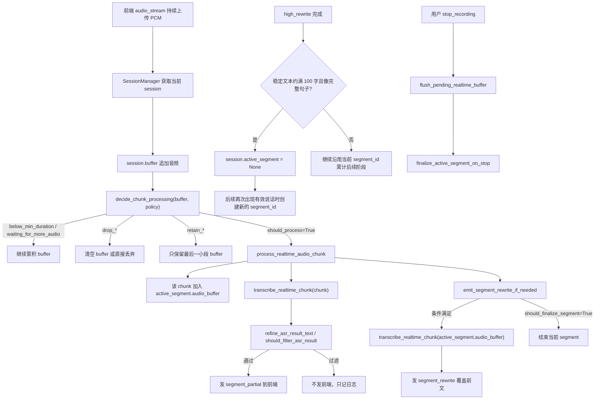
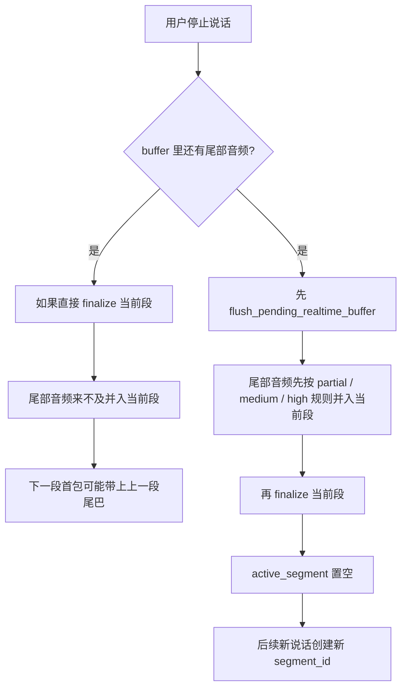

# 实时语音转写当前实现说明 + 简化重构建议

## 1. 文档目的

本文档用于重新建立对“实时语音转写”模块的掌控力，重点回答以下问题：

- 当前实时转写到底是怎么工作的；
- 每一层做了什么处理；
- 做了哪些判断；
- 目前有哪些阈值；
- 为什么会出现“输出延迟”“有些话不出结果”“之前一度很多嗯、后来又过度抑制”的现象；
- 如果要继续开发，应该如何把当前实现收敛成一个更可控、更容易调试的版本。

本文档只聚焦：

- `C:\Users\16010\Desktop\asr_developing_project\asr_project\main.py`
- `C:\Users\16010\Desktop\asr_developing_project\asr_project\services\asr_service.py`

---

## 2. 当前实时转写的总体结构

当前实时转写链路可以分成 6 层：

1. 前端持续上传 PCM 音频流
2. 后端按会话累计 `buffer`
3. 后端根据音频特征判断：
   - 立即上传 ASR
   - 继续等待
   - 直接丢弃
   - 保留最后一小段，等待后续上下文
4. 若允许上传，则对该 chunk 做一次 ASR，得到小段实时结果
5. 小段结果经过文本清洗 / 过滤后再发往前端
6. 同时后端维护段级累计，条件满足时再对更长音频做一次 ASR，并回写替换前面的粗结果

---

## 3. 当前链路流程图

## 3.1 当前串段风险与保护路径

---

## 4. 当前核心数据结构

## 4.1 `SessionManager` 中的实时会话状态

每个 socket 会话当前维护这些关键状态：

- `buffer`
  - 尚未送 ASR 的原始音频缓冲
- `processing`
  - 当前是否正在处理某个 chunk
- `stop_requested`
  - 用户是否已点击停止录音
- `chunk_seq`
  - 已处理 chunk 的计数
- `result_seq`
  - 已发出结果的计数
- `segment_seq`
  - 当前会话中段落计数
- `active_segment`
  - 当前正在累计的大段对象

## 4.2 `active_segment`

当前段对象保存：

- `segment_id`
- `audio_buffer`
  - 当前段累计的原始音频
- `chunk_count`
- `duration_seconds`
- `last_result_id`
  - 前端最近一次可被回写替换的结果 id
- `last_rewrite_chunk_count`
  - 上次 rewrite 时这个段累计到了第几个 chunk
- `latest_display_text`
  - 当前段前端最新展示文本

这说明：当前系统已经不是“每个 chunk 各自为战”，而是存在“段级累计 + 回写替换”的状态机。

---

## 5. 当前音频层处理逻辑

## 5.1 基础音频特征提取

`extract_audio_features()` 会计算：

- `duration_seconds`：当前 buffer 时长
- `rms`：整体归一化能量
- `peak`：整体峰值
- `active_ratio`：活跃帧比例
- `voiced_ratio`：有声音帧比例
- `silence_ratio`：静音帧比例
- `active_seconds`：活跃时长
- `voiced_seconds`：有声时长
- `max_active_run_seconds`：最长连续活跃时长
- `max_voiced_run_seconds`：最长连续有声时长
- `voiced_density`：有声音帧 / 活跃帧

可以把它理解成：

- 不是只看“响不响”
- 还看“像不像连续的人声”
- 还看“是不是只是零碎碎片”

---

## 5.2 当前“可用语音”判断

函数：

- `describe_usable_speech(features, policy)`

当前会把音频分成 5 类：

### 1）`empty_audio`
- 空音频

### 2）`strong_signal`
- 强语音
- 更像清晰明确的人声

### 3）`sustained_voiced`
- 连续有声音
- 即使不算很强，也满足持续性

### 4）`sustained_soft_speech`
- 柔和但持续的弱语音
- 这是为了尽量保住轻声说话

### 5）不可用类
- `fragmented_voiced_presence`
- `no_usable_speech`

它们的典型含义是：

- 有一点声音，但不连续
- 有一点活跃，但不像稳定人声
- 更像碎片噪声、残留尾音、背景干扰

---

## 5.3 当前“尾静音后是否可切出”判断

函数：

- `describe_tail_triggerable_speech(features, policy)`

其目的是判断：

> 这段音频末尾如果已经出现静音，前面的语音部分是否已经“够像一句可以送去识别的话”。

当前返回值包括：

- `tail_strong_signal`
- `tail_sustained_presence`
- `tail_fragmented_presence`
- `tail_presence_too_brief`

只有前两种会触发“尾静音提前上传”。

---

## 5.4 当前“弱背景音”判断

函数：

- `is_weak_background_audio(features, policy)`

主要依据：

- 静音比例很高
- 或 RMS、peak、voiced_ratio 都偏低

它的作用是：

- 尽量拦住弱背景噪声
- 防止这类音频白白送给 ASR，产生 `嗯 / thank you / yeah`

---

## 5.5 当前“短语音保护”判断

函数：

- `has_potential_short_speech(features, policy)`

它的存在原因是：

> 用户明确要求：静音片段不要上传，但很短的有声也可能很重要，不能粗暴误杀。

因此当前系统在某些“不够确认”的情况下，不是立即上传，也不是立即丢，而是：

- 先保留最后一小段缓冲
- 等后续上下文再确认

这就是 `retain_*` 路径。

---

## 6. 当前 chunk 级决策逻辑

函数：

- `decide_chunk_processing(audio_data, policy)`

这是当前最关键的调度函数。

它的输出是 `ChunkDecision`，核心字段有：

- `should_process`
- `reason`
- `drop_buffer`
- `retain_buffer_seconds`
- `trim_trailing_silence`
- `speech_gate_reason`
- `tail_gate_reason`

## 6.1 当前可能出现的主要结果

### A. 继续等待

例如：

- `below_min_duration`
- `insufficient_frames`
- `waiting_for_more_audio`

含义：

- 还没攒够最小处理量
- 暂时既不上传也不丢弃

### B. 立即上传

例如：

- `chunk_duration_reached`
- `max_duration_reached`
- `tail_silence_detected`

含义：

- 当前 chunk 已达到上传条件

### C. 直接丢弃

例如：

- `drop_weak_audio_at_chunk_duration`
- `drop_weak_audio_at_max_duration`
- `drop_weak_background_after_tail_silence`
- `drop_brief_tail_speech`

含义：

- 这段 buffer 被认为价值太低，直接清掉

### D. 保留最后一小段

例如：

- `retain_uncertain_audio_at_chunk_duration`
- `retain_uncertain_audio_at_max_duration`
- `retain_brief_tail_speech`

含义：

- 现在还不能确认值不值得上传
- 但也不想立刻误删
- 所以只保留最后 `uncertain_retain_seconds`

---

## 7. 当前 stop_recording 的补处理逻辑

函数：

- `decide_stop_flush(audio_data, policy)`
- `flush_pending_realtime_buffer()`

用户点击停止录音时：

1. 后端会检查剩余 buffer
2. 如果够条件，会做一次尾段识别
3. 如果当前段还未完成，会尝试做一次最终段级回写

因此当前 stop 不是“简单结束”，而是：

- 尾段补转写
- 段级收尾

这也是你看到：

> 有时候要按“继续录音”或“停止录音”后内容才出来

的一个原因。

---

## 8. 当前文本层处理逻辑

即使音频已经送进 ASR，也不会原样输出。

函数：

- `refine_asr_result_text()`
- `should_filter_asr_result()`

## 8.1 当前文本清洗层级

### 第 1 层：边界语气词清洗

示例：

- `嗯 今天开始` → `今天开始`
- `啊好的` → `好的`

### 第 2 层：低信息片段删除

当前会删很多典型幻觉词：

- 中文：
  - `嗯 啊 呃 额 哦 唔 嘿 咳 呀 哎 诶 欸 哈 嘘`
  - `你好 您好 谢谢 多谢`
- 英文：
  - `yes yeah yep ok okay hello hi huh uh uhh`
  - `thank you thanks`
  - `what / just / right / alright / well / one / was one`

### 第 3 层：上下文型低信息片段

这类不会全局一刀切，只会在“混杂低信息结果”里更容易被删：

- `那`
- `对`
- `好的`
- `是的`
- `是的吧`
- `好`
- `那啥`
- `那个`
- `ok`
- `okay`
- `你好`

### 第 4 层：长尾巴截断

如果正文后面连续挂了一长串：

- `嗯`
- `嘘`
- `thank you`
- `那啥`

这类低信息尾巴，现在会整段裁掉。

---

## 9. 当前段级 rewrite 逻辑

函数：

- `decide_segment_rewrite(...)`
- `emit_segment_rewrite_if_needed(...)`

## 9.1 当前目标

当前段级逻辑的目标是：

- 前端先尽快看到小段 partial
- 后端在累计更多上下文后，重新识别更大音频
- 再用 rewrite 覆盖前面的粗结果

## 9.2 当前 rewrite 触发依据

主要看：

- 段累计时长
- 段累计 chunk 数
- 距离上次 rewrite 新增了多少 chunk
- 最近一次 chunk 是不是尾静音触发
- 当前文本像不像一句能收尾的话

## 9.3 当前 finalize 段落依据

主要看：

- 当前段已经够长
- 或遇到尾静音 + 文本像一句话结束

---

## 10. 当前全部关键阈值

下面列的是当前代码中的默认值。

## 10.1 实时 chunk 基础控制

| 参数 | 默认值 | 作用 |
| --- | ---: | --- |
| `min_audio_seconds` | `1.0` | 少于 1 秒通常不处理 |
| `max_audio_seconds` | `30.0` | buffer 再长也不能无限积累 |
| `chunk_seconds` | `10.0` | 未提前切出时，累计到 10 秒强制做 chunk 处理 |
| `stop_flush_min_seconds` | `0.35` | stop 时少于这个值的尾段通常不处理 |
| `min_speech_frames` | `100` | 最小帧数保护 |

## 10.2 基础静音判定

| 参数 | 默认值 | 作用 |
| --- | ---: | --- |
| `tail_silence_bytes` | `4000` | 尾静音检测窗口大小 |
| `frame_size` | `256` | 音频分析帧大小 |
| `silence_threshold` | `0.001` | 低于此 RMS 视作偏静音 |
| `peak_threshold` | `100` | 低于此峰值视作偏静音 |
| `silence_ratio_threshold` | `0.8` | 静音帧比例高于此可判成尾静音 |

## 10.3 强语音判定

| 参数 | 默认值 |
| --- | ---: |
| `speech_rms_threshold` | `0.004` |
| `speech_peak_threshold` | `280` |

## 10.4 持续语音 / 弱语音判定

| 参数 | 默认值 |
| --- | ---: |
| `min_active_ratio` | `0.12` |
| `min_voiced_ratio` | `0.08` |
| `min_active_seconds` | `0.75` |
| `min_voiced_seconds` | `0.4` |
| `min_voiced_run_seconds` | `0.08` |
| `min_active_run_seconds` | `0.18` |
| `active_speech_rms_threshold` | `0.0032` |
| `active_speech_peak_threshold` | `220` |
| `min_voiced_density_for_soft_speech` | `0.2` |

## 10.5 尾静音触发阈值

| 参数 | 默认值 |
| --- | ---: |
| `tail_trigger_min_active_seconds` | `0.28` |
| `tail_trigger_min_voiced_seconds` | `0.12` |
| `tail_trigger_min_voiced_run_seconds` | `0.06` |

## 10.6 弱背景音阈值

| 参数 | 默认值 |
| --- | ---: |
| `weak_audio_rms_threshold` | `0.0022` |
| `weak_audio_peak_threshold` | `180` |
| `strong_silence_ratio_threshold` | `0.92` |

## 10.7 不确定短语音保留

| 参数 | 默认值 | 作用 |
| --- | ---: | --- |
| `uncertain_retain_seconds` | `1.2` | retain 路径下，保留最后 1.2 秒等待后文 |

## 10.8 段级回写阈值

| 参数 | 默认值 |
| --- | ---: |
| `min_segment_seconds` | `6.0` |
| `min_segment_chunks` | `2` |
| `min_new_chunks_for_rewrite` | `2` |
| `finalize_on_tail_silence_min_seconds` | `4.0` |
| `finalize_on_tail_silence_min_chars` | `14` |
| `sentence_boundary_min_chars` | `6` |
| `max_segment_seconds` | `18.0` |

---

## 11. 当前为何会出现你观察到的问题

## 11.1 “说完后要很久才输出”

最主要原因有 3 个：

### 原因 A：`chunk_seconds = 10.0`

如果尾静音没有满足提前切出条件，系统会一直攒到 10 秒。

这会天然带来很强的延迟。

### 原因 B：尾静音切出条件比较复杂

不是“检测到静音就发”，而是：

- 检测到尾静音
- 同时前面的语音还要满足持续性门槛

否则不会立刻送 ASR。

### 原因 C：retain 路径会主动延迟

为了避免误杀短语音，当前系统在一些边界情况下会：

- 不处理
- 不丢弃
- 只保留最后一小段，等下一段再确认

这提高了保守性，但也增加了实时延迟。

---

## 11.2 “有些话说了也不输出”

原因通常有两类：

### 原因 A：音频层没放行

例如被判成：

- `drop_brief_tail_speech`
- `drop_weak_audio_at_chunk_duration`
- `retain_brief_tail_speech`

也就是说：

- 太短
- 太碎
- 太弱
- 还不够确认

### 原因 B：文本层清洗掉了

即使 ASR 已经返回文本，也可能被：

- 低信息片段过滤
- 上下文型短片段过滤
- 长尾巴裁剪

进一步删掉。

---

## 11.3 “之前很多嗯，后来又几乎不出了，但实时性和完整性变差”

这说明当前系统正处于典型的“多层 patch 叠加”状态：

- 早期问题是：太容易上传静音/弱噪声 → ASR 幻觉多
- 后来修复方式主要是：加更多门槛和过滤
- 结果是：幻觉下降，但实时性和召回率下降

这不是单个参数的问题，而是整个链路已经变得过于复杂。

---

## 12. 当前实现的主要优点

虽然现在复杂，但也不是完全没有价值。

## 12.1 已具备双层结果模型

当前已经有：

- `segment_partial`
- `segment_rewrite`

这为后续“先快出，后修正”打下了基础。

## 12.2 已具备较强的静音压制能力

至少说明：

- 不是所有静音都直接送 ASR
- 已经能拦住一部分明显噪声

## 12.3 已有较好的可观测性

日志里已经能看到：

- `speech_gate`
- `tail_gate`
- `rms`
- `peak`
- `active`
- `voiced`
- `density`
- `active_s`
- `voiced_s`
- `active_run_s`
- `voiced_run_s`
- `silence`

这比“完全黑盒调阈值”要好得多。

---

## 13. 当前实现的主要问题

## 13.1 决策层次过多

当前已经叠了：

1. chunk 触发逻辑
2. 尾静音触发逻辑
3. 弱背景音逻辑
4. 短语音 retain 逻辑
5. 文本低信息过滤
6. 上下文型短片段过滤
7. 长尾巴整段截断
8. 段级 rewrite

这会导致：

- 很难预测系统行为
- 很难定位到底是哪层在误伤

## 13.2 `chunk_seconds=10.0` 不适合作为当前实时默认值

10 秒太长，会直接损害实时反馈。

## 13.3 文本层已经承担了过多“补锅”职责

当前文本层做的不只是语气词清洗，而是在补：

- 静音误上传
- 低信息幻觉
- 尾巴污染

这意味着音频层仍未完全收敛。

## 13.4 retain 路径提高了安全性，但也提高了不可预测性

retain 的原意是好意的，但它会导致：

- 同一句话的输出时间更难预估
- 有时必须等后文
- 有时必须等 stop

这对于实时产品体验是很敏感的。

---

## 14. 简化重构建议

下面是建议的方向：不是继续在现状上补 patch，而是把当前链路收敛成一个更容易掌控的版本。

---

## 15. 简化重构的核心原则

建议只保留 4 层：

### 层 1：切片触发
- 什么时候把一段音频视为一个候选 chunk

### 层 2：音频是否上传
- 只做必要的静音/弱噪声门控

### 层 3：文本基础清洗
- 只做基础语气词和明显低信息垃圾拦截

### 层 4：段级 rewrite
- 负责后续更高质量回写

其它“上下文补丁式逻辑”，都应尽量压缩或降级。

---

## 16. 建议保留的部分

以下建议保留：

### 1）段级 rewrite 框架

即：

- `active_segment`
- `segment_partial`
- `segment_rewrite`
- `replace_target_id`

这是未来质量提升的基础。

### 2）基础音频特征提取

`extract_audio_features()` 很有价值，应保留。

### 3）基础日志观察能力

当前日志字段很重要，不建议砍掉。

### 4）基础 stop flush

停止录音时做尾段补处理是合理的，应保留。

---

## 17. 建议简化或移除的部分

## 17.1 第一优先级建议简化：`chunk_seconds`

建议把默认实时 chunk 从：

- `10.0`

调回更实时的范围，例如：

- `2.0 ~ 3.0`

原因：

- 10 秒太伤实时性
- 即使大段 rewrite 存在，小段 partial 也应该尽快出来

---

## 17.2 第二优先级建议简化：retain 路径

当前 retain 太容易把实时系统变成“要等后文才知道”的半离线系统。

建议：

- 第一版重构时，保留 retain 机制，但只在极少数 stop 边界或尾静音边界使用
- 不要在太多 chunk_duration 场景下 retain

换句话说：

- 更倾向于“短 chunk 先发，后面 rewrite 改”
- 少做“先不发，怕误判”

---

## 17.3 第三优先级建议简化：文本层补丁

建议把文本清洗压回到：

### 保留
- 边界语气词清洗
- 明显低信息整句过滤

### 暂时降级
- 上下文型低信息短片段过滤
- 长尾巴复杂截断

原因：

- 这两层虽然有效，但已经开始侵入正常短句表达
- 更适合作为“第二阶段精修”，而不是主路径基础逻辑

---

## 18. 建议的“简化版目标架构”

建议重构成如下行为：

### 方案目标

#### 小段实时结果
- 2~3 秒内应尽量有 partial

#### 尾静音触发
- 一旦一句话明显结束，应尽快切出

#### 静音压制
- 明显静音/弱噪声不送 ASR

#### 段级回写
- 大段音频到一定规模后，用 rewrite 覆盖前面的粗结果

### 核心思想

> 小段结果负责“快”，大段 rewrite 负责“准”。

当前系统的问题之一，是把“快”和“准”都压在 chunk 放行阶段了。

---

## 19. 建议的简化版阈值起点

以下不是立即改动，而是建议作为下一版重构的起始参数。

## 19.1 chunk 层

| 参数 | 建议起点 |
| --- | ---: |
| `chunk_seconds` | `2.5` |
| `min_audio_seconds` | `0.6` |
| `max_audio_seconds` | `12.0 ~ 15.0` |

## 19.2 stop flush

| 参数 | 建议起点 |
| --- | ---: |
| `stop_flush_min_seconds` | `0.25 ~ 0.3` |

## 19.3 短语音策略

建议：

- 第一轮重构先减少 retain 的使用面
- 更多依赖：
  - 更短 chunk
  - 更快 partial
  - 后续 rewrite 修正

## 19.4 段级 rewrite

可以保留当前量级，先不要大动：

- `min_segment_seconds = 5~6`
- `min_segment_chunks = 2`

---

## 20. 建议的重构实施顺序

## 第 0 步：冻结当前版本

建议把当前版本作为一个可回滚里程碑保留，不再在其上继续无边界补丁式迭代。

## 第 1 步：先做“简化版主路径”

主路径只保留：

1. chunk 触发
2. 音频上传判断
3. 基础文本清洗
4. 段级 rewrite

## 第 2 步：让 partial 恢复实时性

优先把：

- `chunk_seconds`
- `min_audio_seconds`

调回更像“实时系统”的范围。

## 第 3 步：确认 rewrite 还能工作

确认：

- 小段能快速出来
- 大段 still 能覆盖回写

## 第 4 步：最后再决定是否加回高级尾巴过滤

即：

- 上下文型短片段过滤
- 长尾巴截断

这些应作为“第二阶段增强”，而不是当前主路径的基础依赖。

---

## 21. 当前最关键的结论

### 结论 1
当前系统已经不是“简单实时转写”，而是：

- 音频门控
- 文本清洗
- 段级回写

三套逻辑叠加的复杂系统。

### 结论 2
当前“很多嗯没了”与“输出变慢、漏输出”本质上是同一组改动的两面：

- 上传门槛更高
- 文本过滤更强
- 保守 retain 更多

### 结论 3
如果继续在现状上打补丁，很容易继续钻死胡同。

### 结论 4
更好的方向不是继续补一个新规则，而是：

> 先把主路径简化，再用 rewrite 机制去补准确率。

---

## 22. 建议的下一步

建议下一步不要直接改功能，而是先做：

### 《实时语音转写简化版重构方案》

内容包括：

- 新版目标行为
- 保留哪些逻辑
- 删除哪些逻辑
- 新版阈值设计
- 新旧链路对照
- 具体重构步骤

如果你认可，我下一步就基于本文档，继续产出：

**《实时语音转写简化版重构方案》**

然后我们再按方案重构，而不是继续在当前实现上打补丁。
