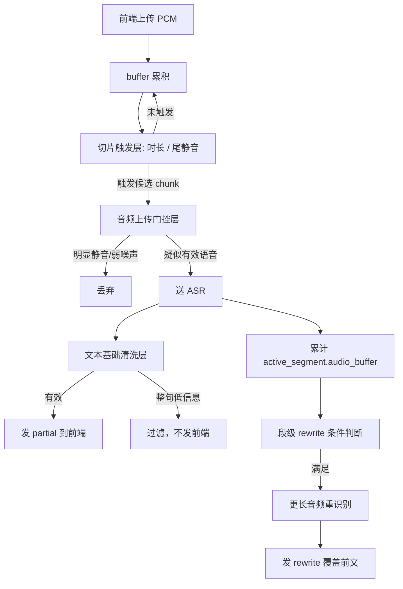

# 实时语音转写简化版重构方案

## 1. 文档目的

本文档不是解释“当前代码是什么”，而是回答：

- 当前实时转写应该如何**重新收敛**；
- 下一版应该保留什么、删掉什么；
- 如何从“补丁叠补丁”的复杂实现，回到一个**可理解、可调参、可迭代**的主链路；
- 如何同时兼顾：
  - 实时性
  - 静音抑制
  - 轻声保留
  - 后续大段 rewrite 回写
  - 双环境兼容

本文档默认建立在：

- `C:\Users\16010\Desktop\asr_developing_project\asr_project\docs\PM\REALTIME_ASR_CURRENT_IMPLEMENTATION.md`

的基础之上。

---

## 2. 重构目标

## 2.1 核心目标

把当前实时转写收敛成一个**四层主路径系统**：

1. **切片触发**
2. **音频上传门控**
3. **文本基础清洗**
4. **段级 rewrite 回写**

除此之外的复杂补丁逻辑，都应尽量：

- 延后
- 降级
- 可选化

---

## 2.2 体验目标

重构后的系统，优先追求以下体验：

### 目标 A：先恢复“能及时出字”

用户说一句话后，不应该经常：

- 等 5~10 秒才出字
- 直到点击“停止录音”才出来

### 目标 B：再控制“无意义输出”

实时阶段可以接受：

- 小段不完美
- 局部有误字

但不能接受：

- 明显静音阶段还在刷 `嗯 / thank you / okay`

### 目标 C：把“准确率提升”交给 rewrite

小段 partial 负责：

- 尽快显示

大段 rewrite 负责：

- 修正
- 补完整句
- 替换粗糙结果

也就是说：

> 实时阶段先保证“快”，不要试图在 chunk 门控阶段就同时把“快”和“准”都做到极致。

---

## 3. 重构原则

## 3.1 原则一：主链路必须可解释

任何一个实时结果为什么会：

- 出来
- 不出来
- 被丢掉
- 被回写

都应该能在日志里清楚解释，而不是依赖多层隐式补丁叠加。

---

## 3.2 原则二：先简后精

先让系统恢复成：

- 行为稳定
- 易于调试
- 阈值可理解

再做更细的优化。

不要一开始就继续往主路径加更多：

- 上下文型短句过滤
- 特殊尾巴规则
- 多重 retain 分支

---

## 3.3 原则三：partial 快，rewrite 准

这是整个重构方案的核心。

### partial
- 允许不完美
- 允许较碎
- 但要快

### rewrite
- 负责改对
- 负责补完整
- 负责合并更长上下文

如果把 partial 门槛抬得太高，就会导致：

- 不出字
- 延迟太大
- 用户体验崩掉

---

## 3.4 原则四：音频门控优先于文本补锅

如果静音/弱噪声大量进入 ASR，再靠文本层去补救，会越来越乱。

因此优先顺序应该是：

1. 优先减少无意义 chunk 上传
2. 再做文本基础清洗
3. 最后才做高级上下文尾巴修正

---

## 3.5 原则五：不得破坏段级 rewrite 的音频累计能力

用户已经明确要求：

- 当前所有修改都要兼容后续多层次音频回写替换

因此重构时应始终遵守：

- 不要把文本过滤反向写死进音频累计逻辑
- 不要为了清理 partial 文本，把本可用于大段 rewrite 的音频直接删坏

---

## 4. 建议的新架构

## 4.1 四层主路径

### 第 1 层：切片触发层

职责：

- 决定什么时候把 buffer 视为一个候选 chunk

只负责：

- 时长
- 尾静音

不负责：

- 高级文本策略
- 长尾巴判断

---

### 第 2 层：音频上传门控层

职责：

- 决定这个候选 chunk 是否值得送 ASR

只保留少数几个判断：

1. 明显静音 / 明显弱背景音 → 不上传
2. 明显有人声 → 上传
3. 极短但可疑的边界人声 → 只允许在 stop flush 或尾边界里做非常有限的保护

这里的关键是：

- **减少 retain 的使用面**

---

### 第 3 层：文本基础清洗层

职责：

- 对 ASR 返回结果做必要清洗

只保留：

1. 边界语气词清洗
2. 整句低信息垃圾过滤
3. 极少量稳定黑名单

不在第一版主路径里保留：

- 太复杂的上下文型短片段过滤
- 复杂长尾巴裁剪规则

这些可以作为二阶段增强，而不是主路径依赖。

---

### 第 4 层：段级 rewrite 层

职责：

- 把多个 partial 累积成更大上下文
- 重新识别
- 回写替换前文

这一层应当成为后续质量提升的主战场，而不是继续把所有压力放在 partial 放行门槛上。

---

## 4.2 新架构流程图

---

## 5. 建议保留的现有组件

## 5.1 必须保留

### 1）`extract_audio_features()`

这是当前最有价值的基础能力之一。

建议保留：

- `rms`
- `peak`
- `active_ratio`
- `voiced_ratio`
- `silence_ratio`
- `active_seconds`
- `voiced_seconds`
- `max_active_run_seconds`
- `max_voiced_run_seconds`
- `voiced_density`

### 2）`active_segment` 段级状态

这是 future rewrite 的基础，必须保留。

### 3）`segment_partial / segment_rewrite / replace_target_id`

这是后续“先快出、后修正”的关键协议，也必须保留。

### 4）`stop flush`

停止录音时尾段补处理应保留，但逻辑要简化。

### 5）实时日志框架

保留以下日志字段非常重要：

- `reason`
- `speech_gate`
- `tail_gate`
- `rms`
- `peak`
- `active`
- `voiced`
- `density`
- `active_s`
- `voiced_s`
- `active_run_s`
- `voiced_run_s`
- `silence`

---

## 6. 建议简化或下线的现有组件

## 6.1 第一优先级：降低 `chunk_seconds`

当前：

- `chunk_seconds = 10.0`

建议第一版简化后默认降到：

- `2.5`

理由：

- 10 秒严重影响实时性
- partial 本来就不该等这么久

---

## 6.2 第二优先级：大幅收缩 retain 路径

当前 retain 用得太多，系统就会从“实时”变成“半等待式”。

建议：

- 第一版重构中，把 retain 限制在非常少的场景
- 默认更倾向于：
  - 有效就发
  - 无效就丢

### 建议保留 retain 的唯一重点场景

- `stop_recording` 之前极短尾音保护

### 建议取消或大幅弱化 retain 的场景

- 常规 `chunk_duration_reached` 上的 retain
- 太多 tail path 的 retain

---

## 6.3 第三优先级：文本层回到“基础清洗”

建议第一版简化时：

### 保留

- `DEFAULT_FILLER_WORDS`
- 边界语气词清洗
- 明显低信息整句过滤

### 降级为可选增强

- `DEFAULT_CONTEXTUAL_LOW_INFORMATION_SEGMENTS`
- 复杂“正文后长尾巴截断”
- 针对个别样本补出来的上下文 patch

理由：

- 这些规则虽然有用，但会进一步增加不可预测性
- 更适合作为第二阶段增强，而不是当前主链路基础依赖

---

## 7. 建议的新默认参数

以下建议作为“简化版重构”的第一轮基线值。

## 7.1 切片与时长

| 参数 | 当前 | 建议 |
| --- | ---: | ---: |
| `min_audio_seconds` | `1.0` | `0.6` |
| `chunk_seconds` | `10.0` | `2.5` |
| `max_audio_seconds` | `30.0` | `12.0` |
| `stop_flush_min_seconds` | `0.35` | `0.25 ~ 0.3` |

### 解释

- `min_audio_seconds` 降低后，更容易及时出 partial
- `chunk_seconds` 降到 2.5 秒后，实时性会明显恢复
- `max_audio_seconds` 降低后，避免 buffer 积太久

---

## 7.2 音频门控

第一轮建议：

- 不要大改基础 `speech_rms_threshold / speech_peak_threshold`
- 优先观察在更短 chunk 下，它们是否已经足够

也就是说：

### 第一轮先动
- 时长类阈值

### 第一轮先不大动
- 强弱语音类细阈值

原因：

- 现在你最痛的不是“偶发少量噪声词”
- 而是“实时性和可预期性丢了”

---

## 7.3 段级 rewrite

建议第一轮基本保留：

| 参数 | 当前 | 建议 |
| --- | ---: | ---: |
| `min_segment_seconds` | `6.0` | `5.0 ~ 6.0` |
| `min_segment_chunks` | `2` | `2` |
| `min_new_chunks_for_rewrite` | `2` | `2` |
| `max_segment_seconds` | `18.0` | `15.0 ~ 18.0` |

原因：

- rewrite 框架本身没必要大动
- 先让 partial 恢复正常，再看 rewrite 的节奏是否要调

---

## 8. 建议的代码层重构顺序

## 第 1 步：冻结当前复杂逻辑

当前版本应作为“复杂实现参考版本”保留，不建议在上面继续直接叠 patch。

推荐把当前版本视作：

- 行为参考
- 日志参考
- 回滚参考

而不是继续作为未来主链路基础。

---

## 第 2 步：先拆出“简化门控版 decision”

建议在 `services/asr_service.py` 中，把当前的：

- `decide_chunk_processing()`

拆成两个明确阶段：

### A. `decide_chunk_trigger()`
只判断：

- 是否达到最小时长
- 是否达到 chunk 时长
- 是否有尾静音

### B. `decide_chunk_upload()`
只判断：

- 这段候选 chunk 是送 ASR，还是丢弃

这样能明显提升可读性。

---

## 第 3 步：建立“简化门控版 policy”

建议不要继续在当前 `RealtimeChunkPolicy` 上无限加字段。

而是明确区分：

### A. `RealtimeTriggerPolicy`
- 专门管切片触发

### B. `RealtimeUploadPolicy`
- 专门管上传门控

### C. `SegmentRewritePolicy`
- 专门管段级 rewrite

这样每类阈值的职责会清晰得多。

---

## 第 4 步：文本层降级为基础版

建议第一轮重构时：

- 默认只保留基础清洗
- 把“上下文型低信息尾巴”“长尾巴截断”收进可选开关

例如未来可以考虑：

- `ENABLE_CONTEXTUAL_LOW_INFO_FILTER=False`
- `ENABLE_LONG_TAIL_TRIM=False`

先让主链路回归清爽，再决定是否重新加回来。

---

## 第 5 步：最后验证 rewrite 兼容性

确认以下事情仍成立：

1. partial 能快速出
2. active_segment 仍累计原始音频
3. rewrite 仍能覆盖前文
4. 同段/跨段逻辑不被破坏

---

## 9. 建议的重构阶段划分

## Phase 1：恢复“能及时出字”

目标：

- 降低延迟
- 降低“说了没输出”

主要动作：

- `chunk_seconds` 降到 `2.5`
- `min_audio_seconds` 降到 `0.6`
- 收缩 retain
- 文本层先只保留基础清洗

验收标准：

- 大多数正常说话在 2~3 秒内能看到 partial

---

## Phase 2：恢复“静音不乱刷”

目标：

- 在 Phase 1 恢复实时性的基础上，再压静音幻觉词

主要动作：

- 校准基础音频门控
- 只保留必要文本黑名单

验收标准：

- 静音期基本不再刷 `嗯 / thank you / okay`

---

## Phase 3：提升“回写质量”

目标：

- 让 partial 快出
- rewrite 明显修正前文

主要动作：

- 调整 `SegmentRewritePolicy`
- 观察前端替换体验

验收标准：

- 用户能明显感知“先快出，再变准”

---

## Phase 4：再决定是否加回高级尾巴策略

只有当：

- 主路径稳定
- 实时性已恢复
- rewrite 也正常

之后，才考虑是否加回：

- 上下文型短片段过滤
- 长尾巴截断

且必须：

- 开关化
- 可回退

---

## 10. 建议的新测试策略

## 10.1 Phase 1 必测

1. 正常说一句话，2~3 秒内能否出 partial
2. 说完停顿，不点 stop 能否自然出字
3. 短句能否出
4. 轻声说话是否被整体吞掉

## 10.2 Phase 2 必测

1. 完全静音时是否还刷 `嗯`
2. 说完一句话后尾巴是否乱刷
3. 弱背景说话是否明显下降

## 10.3 Phase 3 必测

1. rewrite 是否真的覆盖前文
2. 同段是否被正确替换
3. 不同段是否不会互相覆盖

---

## 11. 双环境要求下的注意事项

重构过程中必须遵守：

### 1）不要破坏内网 ASR 适配层

当前重构应只集中在：

- chunk 触发
- chunk 上传门控
- 文本清洗
- rewrite 控制

而不是改动：

- 内网 / 外网 ASR 请求协议
- 鉴权
- 证书
- LLM 调用链路

### 2）优先通过环境变量调参数

建议未来所有新阈值继续支持：

- `ONLINE_REALTIME_*`
- `INTRANET_REALTIME_*`

便于双环境分别微调。

---

## 12. 当前建议的最终决策

### 建议结论

不要继续在当前复杂实现上做局部补丁。

应该转向：

> 以“恢复实时性 + 保住 rewrite 框架”为目标的简化重构。

### 一句话概括

当前系统下一步不该继续追求：

- “再补一个更聪明的过滤规则”

而应该追求：

- “先把 partial 恢复成一个简单、稳定、可解释的实时系统”

然后再把质量提升交给 rewrite。

---

## 13. 建议的下一步执行顺序

如果你同意，后续开发建议按下面顺序推进：

1. 基于本文档，先做一轮**简化重构**
2. 先恢复：
   - 及时出字
   - 有话能出
3. 再做：
   - 静音压制
   - rewrite 质量
4. 最后才考虑：
   - 高级尾巴过滤
   - 上下文型低信息补丁

---

## 14. 建议的下一份文档

如果需要继续提高可执行性，下一份最有价值的文档应是：

### 《实时语音转写简化重构实施清单》

内容可以进一步细化到：

- 第 1 次 commit 改什么
- 第 2 次 commit 改什么
- 每一步怎么测试
- 每一步如何回滚

这样就能直接进入可控开发，而不是继续在复杂现状里试错。
